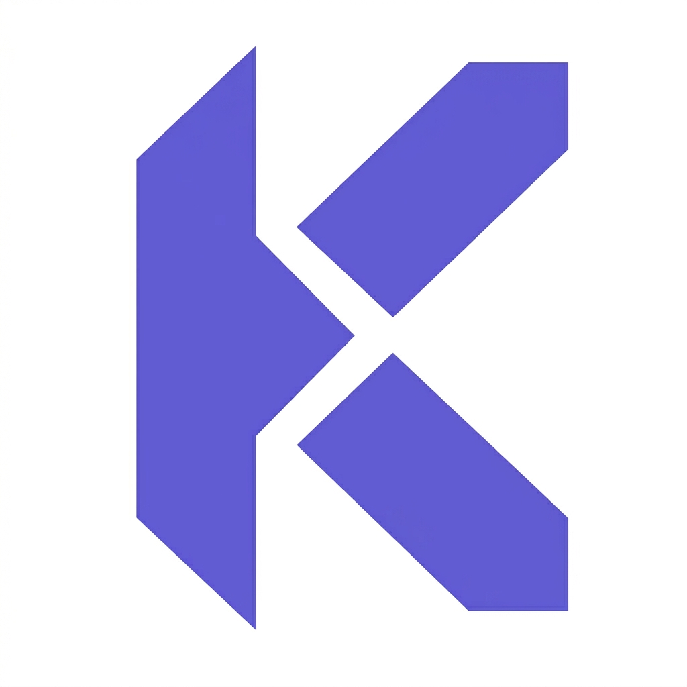

# Kova Language Support

<p align="center">
  
</p>

Kova Language Support brings first-class Visual Studio Code support for the Kova language.

## Features

- `.kova` file recognition
- Syntax highlighting for core Kova constructs
- Language configuration for comments, brackets, and auto-closing pairs
- Starter snippets for common Kova patterns

## Included Support

### Syntax Highlighting
Keywords, strings, numbers, and comments are highlighted for better readability and faster editing.

### Language Configuration
Kova files support:
- line comments
- block comments
- bracket matching
- auto-closing pairs
- surrounding pairs

### Snippets
Starter snippets are included for common constructs such as:
- `let`
- `if`
- `respond`

## Installation

### From the Marketplace
Search for **Kova Language Support** in the Visual Studio Code Extensions view.

### From a VSIX package
1. Open the Extensions view in Visual Studio Code
2. Select the menu in the top-right corner
3. Choose **Install from VSIX...**
4. Select the packaged `.vsix` file

## Quick Start

Create a file with the `.kova` extension:

```kova
let name = "Kova"

if (name) {
  respond name
}
```

## Roadmap

### Planned Improvements
- Richer syntax coverage
- Diagnostics and linting
- Semantic tokens
- formatter support
- language server integration

## Requirements
- Visual Studio Code ^1.80.0

## Known Limitattions
This release focuses on foundational language support. Advanced validation, linting, and formatting are planned for future versions.

## Repository
Source code nad issue tracking are available in the project repository.

## License
MIT

### Commit
```bash
git add README.md
git commit -m "docs(readme): improve marketplace presentation and installation guide"